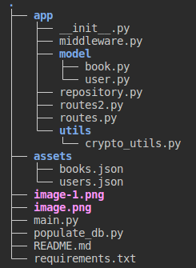

<!-- tree -I __pyca* -->

# Το project

## MongoDB

Πρέπει να έχουμε Docker στον υπολογιστή μας για να παρουμε την εικόνα και να τρέξουμε σε container τη βάση MongoDB.

### Λήψη εικόνας και έναρξη του Container

Μπορείτε να εκτελέσετε την MongoDB Community Edition ως κοντέινερ Docker χρησιμοποιώντας την επίσημη εικόνα της κοινότητας MongoDB.  
Για να κατεβάσουμε την εικόνα εκτελούμε την εντολή `docker pull mongo`.  
Αφού ολοκληρωθεί η λήψη τρέχουμε την εικόνα σαν Container με την εντολή `docker run --name mongodb -p 27017:27017 -d mongo:latest`.  
Τώρα η βάση μας τρέχει στην πόρτα 27017 localhost. Το όνομα του container είναι mongodb.  

### MongoDB Compass

Για να συνδεθούμε με τη βάση και να τη διαχειριστούμε μέσω GUI πρέπει να έχουμε εγκαταστήσει το [MongoDB Compass](https://www.mongodb.com/try/download/compass).  
Αφού το εγκαταστήσουμε το ανοίγουμε και συνδεόμαστε στη βάση που τρέχει στο container mongodb στο URI `mongodb://localhost:27017/` οπως εμφανίζεται στην εικόνα .

## Assets

Ο φάκελος assets περιέχει τις εγγραφές που θα εγγραφούν στη βάση.

### Users

|Field|Type|
|--|--|
|id|string|
|username|string|
|password|string|
|email|string|
|role|Enum["user", "employee", "admin"]|
|active|bool|

### Books

|Field|Type|
|--|--|
|id|string|
|title|string|
|author|string|
|year|int|
|rating|float|
|comments|Array\<string\>|
|cover|string|
|genre|str|
|summary|string|
|items|int|
|price|float|

## Genres

Για να βρούμε τα είδη βιβλίων που υπάρχουν συνολικά στη βάση θα κάνουμε query στο collection genres στη βάση.

## Utils

Περιέχει το αρχείο που κρυπτογραφεί το password

## Πως θα τρέξουμε το project

1. Δημιουργούμε virtual environment
2. Ενεργοποιούμε το virtual environment
3. Εγκαθιστούμε τις βιβλιοθήκες που απαιτούνται και βρίσκονται στο requirements.txt
4. Τρέχουμε το αρχείο populate_db.py με την εντολή  `python populate_db.py`. Στο output θα δούμε ότι δημιουργήθηκαν τα documents.
5. Ξεκινάμε τον server `python main.py`

## Routes

Θα δουλέψετε πάνω στο αρχείο `routes2.py` και στο endpoint `/books`

## PyMongo

Μελετήστε το documentation της PyMongo από το [link](https://pymongo.readthedocs.io/en/stable/tutorial.html).  
Χρήσιμες συναρτήσεις:  

- insert_one()
- insert_many()
- find()
- find_one()
- update_one()

Χρήσιμα links:

- [Query and Projection Operators](https://www.mongodb.com/docs/manual/reference/operator/query/)
- [Cursor](https://pymongo.readthedocs.io/en/stable/api/pymongo/cursor.html#pymongo.cursor.Cursor.collection)
